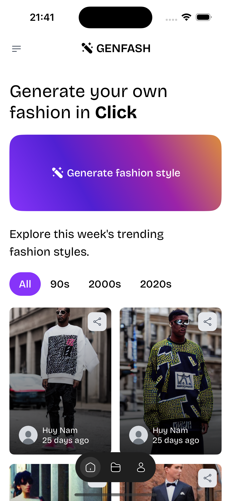
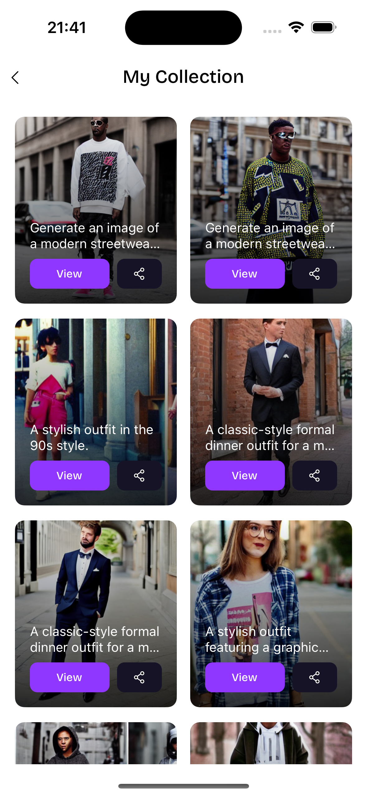
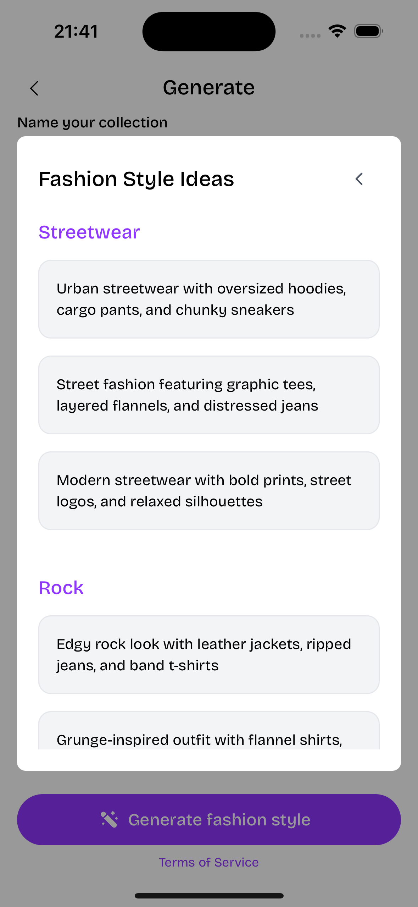

# 📸 Genfash
 
Transform your fashion ideas into stunning visuals with **Genfash**, an AI-powered app that generates unique, high-quality fashion images tailored to your style!

## ✨ Features
- 🧠 AI-generated fashion images based on your inputs
- 🎨 Customize designs with vibrant colors, patterns, and textures
- 🖌️ Intuitive editing tools for fine-tuning your creations
- 🔥 Apply cinematic filters and effects for a polished look
- 💾 Export and share high-resolution images effortlessly

## 📷 Screenshots
<table align="center">
  <tr>
    <td align="center" width="25%">
      
    </td>
    <td align="center" width="25%">
      
    </td>
    <td align="center" width="25%">
      
    </td>
  </tr>
  <tr>
    <td align="center" width="25%">
      
    </td>
    <td align="center" width="25%">
      
    </td>
     <td align="center" width="25%">
      
    </td>
  </tr>
</table>

## 🚀 Installation
```bash
# Clone the repository
git clone https://github.com/huynamboz/genfash.git
cd genfash

# Install dependencies
yarn install # or npm install

# Run the app
yarn start # or npm start
```

## 🛠️ Tech Stack
- **React Native** (CLI, no Expo)
- **React Native Vision Camera** (for photo capture and processing)
- **React Native Reanimated** (smooth animations)

- **AI Integration** (custom AI model for fashion image generation)

## 🤝 Contributing
We love contributions! Whether it's a bug fix, feature idea, or feedback, feel free to:
1. Open an issue to discuss your ideas
2. Submit a pull request with your changes

## 📜 License
MIT License © 2025 huynamboz

---

💡 *Download Genfash now and bring your fashion vision to life with AI!*